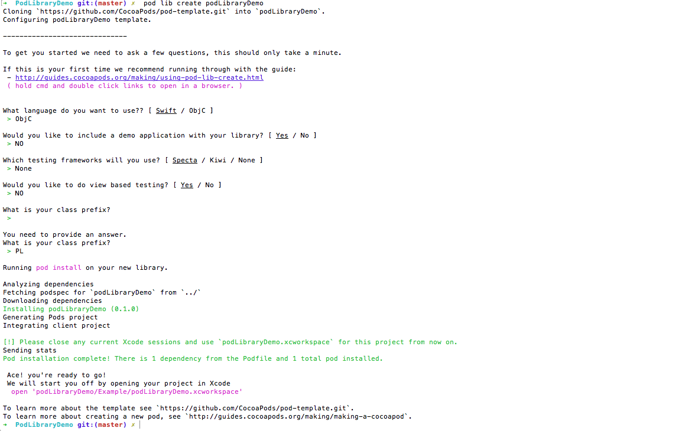
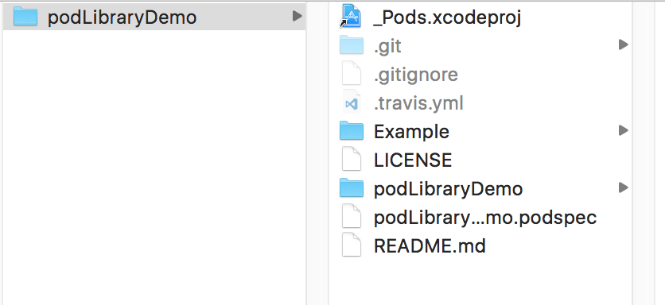
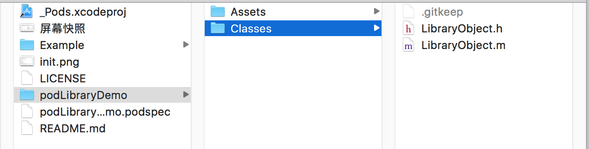

# PodLibraryDemo


# 1： 创建pod工程

```
pod lib create podLibraryDemo

```



#创建后的目录结构


项目生成的目录结构及相关介绍。

Example 目录为当前pod的测试工程

podLibraryDemo pod管理文件夹

Assets 资源文件目录
Classes 代码类文件目录
接下来就是向Pod文件夹中添加库文件和资源，并配置podspec文件，我把一个网络模块的共有组件放入Pod/Classes中，然后进入Example文件夹执行`pod update`命令，再打开项目工程可以看到，刚刚添加的组件已经在Pods子工程下Example/Pods中了，然后编辑demo工程，测试组件，我并没有使用提供的测试框架进行测试，这里就先不介绍了。



#编辑.podspec配置文件


```
Pod::Spec.new do |s|
s.name = "PodTestLibrary" #名称
s.version = "0.1.0" #版本号
s.summary = "Just Testing." #简短介绍，下面是详细介绍
s.description = <<-DESC
Testing Private Podspec.
* Markdown format.
* Don't worry about the indent, we strip it!
DESC
s.homepage = "https://github.com/YuXueBJ/PodLibrary/podLibrary" #主页,这里要填写可以访问到的地址，不然验证不通过
# s.screenshots = "www.example.com/screenshots_1", "www.example.com/screenshots_2" #截图
s.license = 'MIT' #开源协议
s.author = { "wtlucky" => "wtlucky@foxmail.com" } #作者信息
s.source = { :git => "https://github.com/YuXueBJ/PodLibraryDemo.git", :tag => "0.1.0" } #项目地址，这里不支持ssh的地址，验证不通过，只支持HTTP和HTTPS，最好使用HTTPS
# s.social_media_url = 'https://twitter.com/<twitter_username>' #多媒体介绍地址
s.platform = :ios, '7.0' #支持的平台及版本
s.requires_arc = true #是否使用ARC，如果指定具体文件，则具体的问题使用ARC
s.source_files = 'Pod/Classes/**/*' #代码源文件地址，**/*表示Classes目录及其子目录下所有文件，如果有多个目录下则用逗号分开，如果需要在项目中分组显示，这里也要做相应的设置
s.resource_bundles = {
'PodTestLibrary' => ['Pod/Assets/*.png']
} #资源文件地址
s.public_header_files = 'Pod/Classes/**/*.h' #公开头文件地址
s.frameworks = 'UIKit' #所需的framework，多个用逗号隔开
s.dependency 'AFNetworking', '~> 2.3' #依赖关系，该项目所依赖的其他库，如果有多个需要填写多个s.dependency
end</twitter_username>


```

